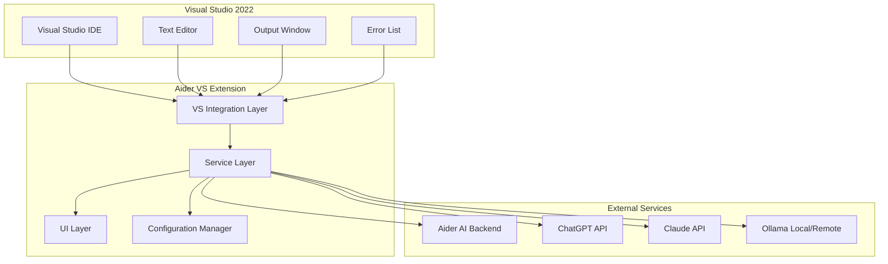

# Design Document

## Overview

The Aider Visual Studio 2022 Extension is designed as a comprehensive AI-powered development assistant that integrates Aider AI capabilities directly into the Visual Studio IDE. The extension follows the VSIX (Visual Studio Extension) architecture pattern and implements a modular design with clear separation of concerns between UI components, AI service integration, and Visual Studio API interactions.

The extension provides three main functional areas:
1. **Chat Interface**: A dockable tool window with contextual resource referencing
2. **Editor Integration**: Visual diff display and text selection for chat context
3. **AI Completion**: Configurable AI-powered tab completion with multiple provider support

## Architecture

### High-Level Architecture



### Component Architecture

The extension is structured using the following architectural layers:

1. **UI Layer**: WPF-based user interface components
2. **Service Layer**: Business logic and AI service orchestration
3. **Integration Layer**: Visual Studio API interactions and event handling
4. **Configuration Layer**: Settings management and persistence

## Components and Interfaces

### 1. Chat Interface Components

#### ChatToolWindow
- **Purpose**: Main dockable tool window for Aider AI chat
- **Implementation**: Inherits from `ToolWindowPane`
- **Key Features**:
  - WPF UserControl with chat message display
  - Input field with # key context menu trigger
  - Message history persistence
  - Real-time Aider AI communication

#### ContextMenuProvider
- **Purpose**: Handles # key context menu functionality
- **Implementation**: Custom WPF control with popup menu
- **Supported Contexts**:
  - Files (solution explorer integration)
  - Clipboard content
  - Git branches (LibGit2Sharp integration)
  - Web search (integrated browser or external API)
  - Documentation resources
  - Search input with file filtering

#### MessageRenderer
- **Purpose**: Renders chat messages with syntax highlighting
- **Implementation**: Custom WPF control using AvalonEdit or similar
- **Features**:
  - Code syntax highlighting
  - File reference links
  - Markdown support for AI responses

### 2. Editor Integration Components

#### TextSelectionHandler
- **Purpose**: Manages text selection and context menu integration
- **Implementation**: IVsTextViewCreationListener implementation
- **Features**:
  - Context menu extension for "Add to Chat"
  - Line number and file path tracking
  - Selected text extraction and formatting

#### DiffVisualizer
- **Purpose**: Displays visual diffs for Aider changes
- **Implementation**: IVsTextViewCreationListener with custom adornments
- **Features**:
  - Red highlighting for removed lines
  - Green highlighting for added lines
  - Line-by-line diff calculation
  - Hover tooltips with change details
  - Navigation between changed files

#### ErrorIntegrationHandler
- **Purpose**: Integrates with Visual Studio error systems
- **Implementation**: 
  - IVsErrorListProvider for error list integration
  - IVsOutputWindowPane for output window integration
- **Features**:
  - "Fix with Aider" quick fix provider
  - "Add to Aider Chat" buttons in output window
  - Error context extraction and formatting

### 3. AI Completion Components

#### CompletionProvider
- **Purpose**: Provides AI-powered tab completion
- **Implementation**: IAsyncCompletionSource implementation
- **Features**:
  - Multi-provider support (ChatGPT, Claude, Ollama)
  - Context-aware code completion
  - Fallback to standard IntelliSense
  - Configurable completion triggers

#### AIModelManager
- **Purpose**: Manages different AI model configurations and connections
- **Implementation**: Singleton service with provider pattern
- **Supported Models**:
  - OpenAI GPT models (API key authentication)
  - Anthropic Claude models (API key authentication)
  - Ollama models (local/remote endpoint configuration)

### 4. Service Layer Components

#### AiderService
- **Purpose**: Core service for Aider AI communication
- **Implementation**: Singleton service with async/await patterns
- **Features**:
  - WebSocket or HTTP communication with Aider backend
  - Message queuing and retry logic
  - Session management and persistence
  - Error handling and logging

#### ConfigurationService
- **Purpose**: Manages extension settings and user preferences
- **Implementation**: Uses Visual Studio Settings Store
- **Settings Categories**:
  - AI model selection and API keys
  - Chat interface preferences
  - Diff visualization options
  - Completion behavior settings

#### FileContextService
- **Purpose**: Handles file and solution context extraction
- **Implementation**: Uses DTE2 and IVsSolution interfaces
- **Features**:
  - Solution file enumeration
  - Git repository integration
  - File content extraction
  - Search and filtering capabilities

## Data Models

### ChatMessage
```csharp
public class ChatMessage
{
    public string Id { get; set; }
    public string Content { get; set; }
    public MessageType Type { get; set; } // User, Assistant, System
    public DateTime Timestamp { get; set; }
    public List<FileReference> References { get; set; }
    public string ModelUsed { get; set; }
}
```

### FileReference
```csharp
public class FileReference
{
    public string FilePath { get; set; }
    public int StartLine { get; set; }
    public int EndLine { get; set; }
    public string Content { get; set; }
    public ReferenceType Type { get; set; } // File, Selection, Error
}
```

### AIModelConfiguration
```csharp
public class AIModelConfiguration
{
    public AIProvider Provider { get; set; } // ChatGPT, Claude, Ollama
    public string ApiKey { get; set; }
    public string EndpointUrl { get; set; } // For Ollama
    public string ModelName { get; set; }
    public bool IsEnabled { get; set; }
    public Dictionary<string, object> AdditionalSettings { get; set; }
}
```

### DiffChange
```csharp
public class DiffChange
{
    public string FilePath { get; set; }
    public int LineNumber { get; set; }
    public ChangeType Type { get; set; } // Added, Removed, Modified
    public string OriginalContent { get; set; }
    public string NewContent { get; set; }
    public DateTime Timestamp { get; set; }
}
```

## Error Handling

### Exception Hierarchy
- **AiderExtensionException**: Base exception for all extension-related errors
- **AIServiceException**: AI service communication errors
- **ConfigurationException**: Configuration and settings errors
- **FileAccessException**: File system and solution access errors

### Error Handling Strategy
1. **Graceful Degradation**: Extension continues to function with reduced capabilities when services are unavailable
2. **User Notification**: Clear error messages through Visual Studio's notification system
3. **Logging**: Comprehensive logging to Visual Studio output window and extension-specific log files
4. **Retry Logic**: Automatic retry for transient network and service errors
5. **Fallback Mechanisms**: Standard Visual Studio features when AI services are unavailable

### Error Recovery
- **AI Service Failures**: Fall back to standard IntelliSense for completion
- **Aider Backend Issues**: Queue messages for retry when connection is restored
- **Configuration Errors**: Provide guided setup wizard for first-time configuration

## Testing Strategy

### Unit Testing
- **Framework**: MSTest or xUnit with Visual Studio Test SDK
- **Coverage**: All service layer components and business logic
- **Mocking**: Mock Visual Studio interfaces using Microsoft Fakes or Moq
- **Test Categories**:
  - AI service integration tests
  - Configuration management tests
  - File context extraction tests
  - Message processing and formatting tests

### Integration Testing
- **Visual Studio Integration**: Test extension loading and UI component integration
- **AI Service Integration**: Test actual API calls with test accounts/endpoints
- **File System Integration**: Test solution and file access scenarios
- **Error Handling Integration**: Test error scenarios and recovery mechanisms

### UI Testing
- **Framework**: Coded UI Tests or similar Visual Studio testing framework
- **Test Scenarios**:
  - Chat interface interaction flows
  - Context menu functionality
  - Diff visualization display
  - Settings configuration workflows

### Performance Testing
- **Completion Latency**: Measure AI completion response times
- **Memory Usage**: Monitor extension memory footprint during extended use
- **File Processing**: Test performance with large solutions and files
- **Concurrent Operations**: Test multiple simultaneous AI requests

### Manual Testing Scenarios
1. **End-to-End Chat Workflow**: Complete conversation with file references and code changes
2. **Error Resolution Workflow**: Use "Fix with Aider" feature for various error types
3. **Multi-Model Configuration**: Switch between different AI providers
4. **Large Solution Testing**: Test with enterprise-scale Visual Studio solutions
5. **Network Resilience**: Test behavior with intermittent network connectivity