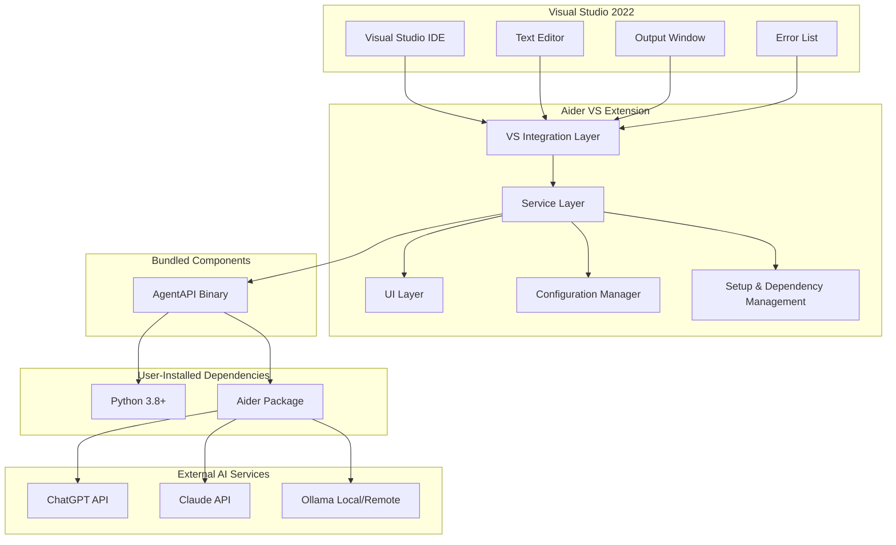
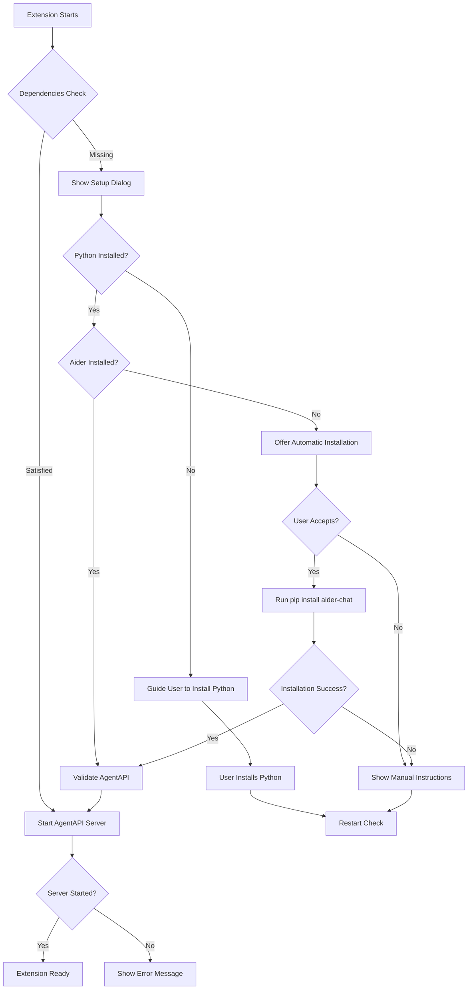

# Design Document

## Overview

The Aider Visual Studio 2022 Extension is designed as a comprehensive AI-powered development assistant that integrates Aider AI capabilities directly into the Visual Studio IDE. The extension follows the VSIX (Visual Studio Extension) architecture pattern and implements a modular design with clear separation of concerns between UI components, AI service integration, and Visual Studio API interactions.

The extension provides three main functional areas:
1. **Chat Interface**: A dockable tool window with contextual resource referencing
2. **Editor Integration**: Visual diff display and text selection for chat context
3. **AI Completion**: Configurable AI-powered tab completion with multiple provider support

## Architecture

### High-Level Architecture



### Component Architecture

The extension is structured using the following architectural layers:

1. **UI Layer**: WPF-based user interface components
2. **Service Layer**: Business logic and AI service orchestration
3. **Integration Layer**: Visual Studio API interactions and event handling
4. **Configuration Layer**: Settings management and persistence

## Components and Interfaces

### 1. Chat Interface Components

#### ChatToolWindow
- **Purpose**: Main dockable tool window for Aider AI chat
- **Implementation**: Inherits from `ToolWindowPane`
- **Key Features**:
  - WPF UserControl with chat message display
  - Input field with # key context menu trigger
  - Message history persistence
  - Real-time Aider AI communication

#### ContextMenuProvider
- **Purpose**: Handles # key context menu functionality
- **Implementation**: Custom WPF control with popup menu
- **Supported Contexts**:
  - Files (solution explorer integration)
  - Clipboard content
  - Git branches (LibGit2Sharp integration)
  - Web search (integrated browser or external API)
  - Documentation resources
  - Search input with file filtering

#### MessageRenderer
- **Purpose**: Renders chat messages with syntax highlighting
- **Implementation**: Custom WPF control using AvalonEdit or similar
- **Features**:
  - Code syntax highlighting
  - File reference links
  - Markdown support for AI responses

### 2. Editor Integration Components

#### TextSelectionHandler
- **Purpose**: Manages text selection and context menu integration
- **Implementation**: IVsTextViewCreationListener implementation
- **Features**:
  - Context menu extension for "Add to Chat"
  - Line number and file path tracking
  - Selected text extraction and formatting

#### DiffVisualizer
- **Purpose**: Displays visual diffs for Aider changes
- **Implementation**: IVsTextViewCreationListener with custom adornments
- **Features**:
  - Red highlighting for removed lines
  - Green highlighting for added lines
  - Line-by-line diff calculation
  - Hover tooltips with change details
  - Navigation between changed files

#### ErrorIntegrationHandler
- **Purpose**: Integrates with Visual Studio error systems
- **Implementation**: 
  - IVsErrorListProvider for error list integration
  - IVsOutputWindowPane for output window integration
- **Features**:
  - "Fix with Aider" quick fix provider
  - "Add to Aider Chat" buttons in output window
  - Error context extraction and formatting

### 3. AI Completion Components

#### CompletionProvider
- **Purpose**: Provides AI-powered tab completion
- **Implementation**: IAsyncCompletionSource implementation
- **Features**:
  - Multi-provider support (ChatGPT, Claude, Ollama)
  - Context-aware code completion
  - Fallback to standard IntelliSense
  - Configurable completion triggers

#### AIModelManager
- **Purpose**: Manages different AI model configurations and connections
- **Implementation**: Singleton service with provider pattern
- **Supported Models**:
  - OpenAI GPT models (API key authentication)
  - Anthropic Claude models (API key authentication)
  - Ollama models (local/remote endpoint configuration)

### 4. Service Layer Components

#### AiderService
- **Purpose**: Core service for Aider AI communication via AgentAPI wrapper
- **Implementation**: Singleton service with async/await patterns
- **Architecture**: Hybrid deployment model with bundled AgentAPI and user-installed Aider
- **Features**:
  - HTTP communication with local AgentAPI server
  - Automatic dependency detection and setup flow
  - Process lifecycle management for AgentAPI server
  - Message queuing and retry logic with circuit breaker patterns
  - Session management and persistence
  - Comprehensive error handling and telemetry
  - Correlation tracking for debugging and monitoring

#### AgentApiService
- **Purpose**: Manages AgentAPI server process and HTTP communication
- **Implementation**: Process management with platform-specific executable detection
- **Features**:
  - Automatic AgentAPI server startup and health monitoring
  - Cross-platform executable detection (Windows/macOS/Linux)
  - Graceful shutdown with process cleanup
  - HTTP client with timeout and retry policies
  - Real-time server output monitoring and logging

#### AiderDependencyChecker
- **Purpose**: Validates and manages Python and Aider installation requirements
- **Implementation**: Cross-platform dependency detection and installation
- **Features**:
  - Python 3.8+ detection and version validation
  - Aider package installation via pip
  - Automatic upgrade management
  - Fallback executable path discovery
  - Installation status reporting and error guidance

#### AiderSetupManager
- **Purpose**: Orchestrates user setup flow and dependency validation
- **Implementation**: UI workflow management with Visual Studio integration
- **Features**:
  - Automatic dependency checking during extension startup
  - Interactive setup dialog with progress tracking
  - Manual setup triggering from chat interface
  - Setup completion validation and confirmation
  - Graceful fallback for setup failures

#### ConfigurationService
- **Purpose**: Manages extension settings and user preferences
- **Implementation**: Uses Visual Studio Settings Store
- **Settings Categories**:
  - AI model selection and API keys
  - Chat interface preferences
  - Diff visualization options
  - Completion behavior settings

#### FileContextService
- **Purpose**: Handles file and solution context extraction
- **Implementation**: Uses DTE2 and IVsSolution interfaces
- **Features**:
  - Solution file enumeration
  - Git repository integration
  - File content extraction
  - Search and filtering capabilities

## Data Models

### ChatMessage
```csharp
public class ChatMessage
{
    public string Id { get; set; }
    public string Content { get; set; }
    public MessageType Type { get; set; } // User, Assistant, System
    public DateTime Timestamp { get; set; }
    public List<FileReference> References { get; set; }
    public string ModelUsed { get; set; }
}
```

### FileReference
```csharp
public class FileReference
{
    public string FilePath { get; set; }
    public int StartLine { get; set; }
    public int EndLine { get; set; }
    public string Content { get; set; }
    public ReferenceType Type { get; set; } // File, Selection, Error
}
```

### AIModelConfiguration
```csharp
public class AIModelConfiguration
{
    public AIProvider Provider { get; set; } // ChatGPT, Claude, Ollama
    public string ApiKey { get; set; }
    public string EndpointUrl { get; set; } // For Ollama
    public string ModelName { get; set; }
    public bool IsEnabled { get; set; }
    public Dictionary<string, object> AdditionalSettings { get; set; }
}
```

### DiffChange
```csharp
public class DiffChange
{
    public string FilePath { get; set; }
    public int LineNumber { get; set; }
    public ChangeType Type { get; set; } // Added, Removed, Modified
    public string OriginalContent { get; set; }
    public string NewContent { get; set; }
    public DateTime Timestamp { get; set; }
}
```

### AgentApiRequest
```csharp
public class AgentApiRequest
{
    public string Content { get; set; }
    public string Type { get; set; } = "user";
    public List<string> Files { get; set; } = new List<string>();
    public Dictionary<string, object> Metadata { get; set; } = new Dictionary<string, object>();
}
```

### AgentApiResponse
```csharp
public class AgentApiResponse
{
    public string Content { get; set; }
    public string Role { get; set; }
    public DateTime Timestamp { get; set; }
    public List<string> FilesModified { get; set; }
    public List<SuggestedChange> SuggestedChanges { get; set; }
    public Dictionary<string, object> Metadata { get; set; }
}
```

### AiderDependencyStatus
```csharp
public class AiderDependencyStatus
{
    public bool IsPythonInstalled { get; set; }
    public string PythonVersion { get; set; }
    public string PythonPath { get; set; }
    public bool IsAiderInstalled { get; set; }
    public string AiderVersion { get; set; }
    public string AiderPath { get; set; }
    public List<string> MissingDependencies { get; set; } = new List<string>();
    public string ErrorMessage { get; set; }
}
```

### AgentApiConfig
```csharp
public class AgentApiConfig
{
    public string Host { get; set; } = "localhost";
    public int Port { get; set; } = 3284;
    public string Model { get; set; } = "sonnet";
    public TimeSpan StartupTimeout { get; set; } = TimeSpan.FromSeconds(30);
    public TimeSpan RequestTimeout { get; set; } = TimeSpan.FromMinutes(5);
    public string AgentApiExecutablePath { get; set; }
    public Dictionary<string, string> Environment { get; set; } = new Dictionary<string, string>();
}
```

## Deployment Architecture

### Hybrid Deployment Model

The Aider VS Extension implements a hybrid deployment architecture that balances ease of installation with flexibility and maintainability:

#### Bundled Components (Extension Package)
- **AgentAPI Binaries**: Platform-specific AgentAPI executables bundled in the VSIX package
  - `tools/agentapi.exe` (Windows)
  - `tools/agentapi-macos` (macOS)
  - `tools/agentapi-linux` (Linux)
- **Extension Code**: All C# extension code and UI components
- **Configuration Templates**: Default settings and configuration schemas

#### User-Installed Dependencies
- **Python 3.8+**: Must be installed by the user and available in system PATH
- **Aider Package**: Installed via pip (`pip install aider-chat`)
- **AI Service Credentials**: User-provided API keys for OpenAI, Anthropic, etc.

### Setup Flow



### Process Architecture

The extension manages the following processes:

1. **Visual Studio Process**: Hosts the extension and UI components
2. **AgentAPI Server Process**: Spawned by the extension, acts as HTTP server
3. **Aider Process**: Spawned by AgentAPI, handles AI communication

```
┌─────────────────┐    HTTP     ┌─────────────────┐    CLI     ┌─────────────────┐
│ VS Extension    │ ◄──────────► │ AgentAPI Server │ ◄─────────► │ Aider Process   │
│ (C# Code)       │             │ (Python/Go)    │            │ (Python)        │
└─────────────────┘             └─────────────────┘            └─────────────────┘
         │                               │                              │
         ▼                               ▼                              ▼
┌─────────────────┐             ┌─────────────────┐            ┌─────────────────┐
│ Visual Studio   │             │ Local HTTP      │            │ OpenAI/Claude/  │
│ UI & APIs       │             │ Port 3284       │            │ Ollama APIs     │
└─────────────────┘             └─────────────────┘            └─────────────────┘
```

### Advantages of This Architecture

1. **Easy Installation**: Users just install the VSIX package
2. **No Admin Rights**: No need for elevated permissions during installation
3. **Platform Independence**: AgentAPI binaries handle platform differences
4. **Version Control**: Extension controls AgentAPI version compatibility
5. **Flexibility**: Users can upgrade Aider independently
6. **Security**: Uses local HTTP communication, no external dependencies
7. **Fallback Support**: Graceful degradation when dependencies are missing

### Security Considerations

- **Local Communication**: All communication is local HTTP (localhost only)
- **Process Isolation**: Each component runs in its own process
- **No Elevated Permissions**: Extension runs with user permissions only
- **API Key Management**: User-provided keys stored in Visual Studio settings store
- **File Access**: Limited to user's solution/project files

## Error Handling

### Exception Hierarchy
- **AiderExtensionException**: Base exception for all extension-related errors
- **AIServiceException**: AI service communication errors
- **ConfigurationException**: Configuration and settings errors
- **FileAccessException**: File system and solution access errors

### Error Handling Strategy
1. **Graceful Degradation**: Extension continues to function with reduced capabilities when services are unavailable
2. **User Notification**: Clear error messages through Visual Studio's notification system
3. **Logging**: Comprehensive logging to Visual Studio output window and extension-specific log files
4. **Retry Logic**: Automatic retry for transient network and service errors
5. **Fallback Mechanisms**: Standard Visual Studio features when AI services are unavailable

### Error Recovery
- **AI Service Failures**: Fall back to standard IntelliSense for completion
- **Aider Backend Issues**: Queue messages for retry when connection is restored
- **Configuration Errors**: Provide guided setup wizard for first-time configuration

## Testing Strategy

### Unit Testing
- **Framework**: MSTest or xUnit with Visual Studio Test SDK
- **Coverage**: All service layer components and business logic
- **Mocking**: Mock Visual Studio interfaces using Microsoft Fakes or Moq
- **Test Categories**:
  - AI service integration tests
  - Configuration management tests
  - File context extraction tests
  - Message processing and formatting tests

### Integration Testing
- **Visual Studio Integration**: Test extension loading and UI component integration
- **AI Service Integration**: Test actual API calls with test accounts/endpoints
- **File System Integration**: Test solution and file access scenarios
- **Error Handling Integration**: Test error scenarios and recovery mechanisms

### UI Testing
- **Framework**: Coded UI Tests or similar Visual Studio testing framework
- **Test Scenarios**:
  - Chat interface interaction flows
  - Context menu functionality
  - Diff visualization display
  - Settings configuration workflows

### Performance Testing
- **Completion Latency**: Measure AI completion response times
- **Memory Usage**: Monitor extension memory footprint during extended use
- **File Processing**: Test performance with large solutions and files
- **Concurrent Operations**: Test multiple simultaneous AI requests

### Manual Testing Scenarios
1. **End-to-End Chat Workflow**: Complete conversation with file references and code changes
2. **Error Resolution Workflow**: Use "Fix with Aider" feature for various error types
3. **Multi-Model Configuration**: Switch between different AI providers
4. **Large Solution Testing**: Test with enterprise-scale Visual Studio solutions
5. **Network Resilience**: Test behavior with intermittent network connectivity